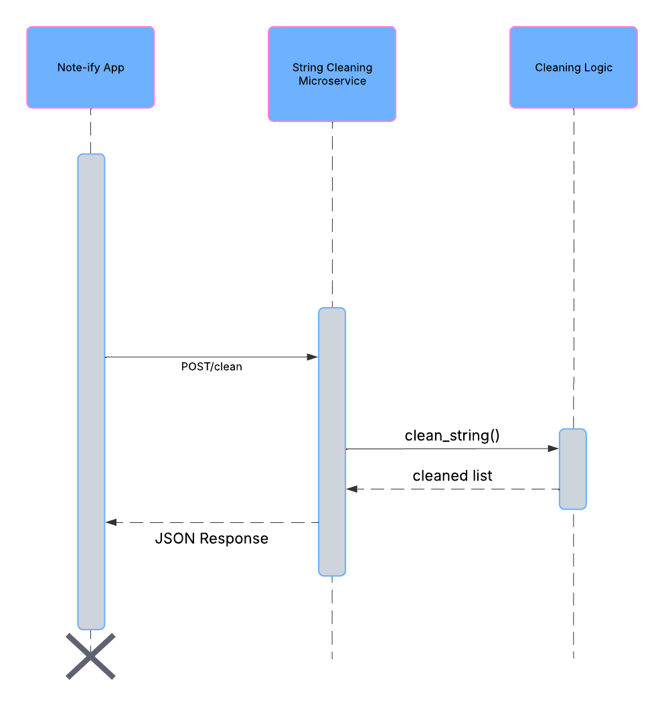

# CS361_TeamMicroservice

### String Cleaner
This microservice accepts a request containing a string and responds with a 
list of cleaned words from that string. It is intended for use in the Note-ify 
note-taking app to clean category/tag data before saving or processing it.

# Communication Contract

### How to Programmatically Request Data from the Microservice
The POST endpoint: POST http://127.0.0.1:5000/clean
The microservice expects the key named "string", followed by a comma-separated
selection of words. Whitespace before or after words get removed automatically.
JOSN Body Format: {"string": "Creams, life, favorite"}
Example of a full request in Python:

import requests
url = "http://127.0.0.1:5000/clean"
payload = {"string": "Creams, life, favorite"}
response = requests.post(url, json=payload)
print(response.status_code)
print(response.json())

### How to Programmatically Receive Data from the Microservice
After a valid request, the microservice will return a JSON object containing
a cleaned list of words.
JSON Response: {"cleaned": ["Creams", "life", "favorite"]}
Example of receiving call:

data = response.json()
cleaned_list = data["cleaned"]
print("Cleaned List:", cleaned_list)

## Notes to consider
If the input string is empty, or only contains commas, whitespace, or a combination, 
the service will return {"cleaned":[]}.
If the input is invalid a status code of 400 will be returned with an error message.

### UML Sequence Diagram

